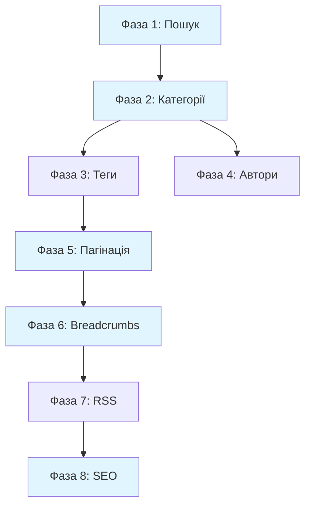

# План вдосконаленого функціоналу блогу

## Поточний стан

Зараз в проекті реалізовано:

- ✅ Backend колекції: `Posts`, `Categories`, `Authors`, `Tags` 
- ✅ Базові API функції в `[src/api/blog.ts](src/api/blog.ts)`
- ✅ Сторінка списку статей `[/blog](src/app/(site)`/blog/page.tsx)
- ✅ Сторінка окремої статті `[/blog/[slug]](src/app/(site)`/blog/[slug]/page.tsx)
- ✅ Open Graph метадані
- ✅ shadCN компоненти: `Breadcrumb`, `Pagination`

Потрібно додати:

- ❌ Пошук по статтях
- ❌ Сторінки категорій і тегів
- ❌ Сторінка автора
- ❌ Пагінація на списку статей
- ❌ Breadcrumbs навігація
- ❌ RSS feed
- ❌ JSON-LD structured data
- ❌ Sitemap з блог-статтями
- ❌ Twitter Cards

---

## Фаза 1: Пошук по статтях

### Архітектура

**Client-side пошук** з використанням shadCN компонентів:

- Компонент пошуку буде фільтрувати завантажені статті
- Пошук по полях: `title`, `excerpt`, `content_html`
- Легка інтеграція, не потребує змін backend

### Файли для створення/оновлення

**1.1 Search компонент**

- Створити `[src/components/blog/BlogSearch.tsx](src/components/blog/BlogSearch.tsx)`
- Використати shadCN `Input` та `Command` компоненти
- Debounce для оптимізації
- Keyboard shortcuts (Cmd+K / Ctrl+K)

```typescript
// Структура компонента
interface BlogSearchProps {
  posts: Post[]
  onSearch: (filtered: Post[]) => void
}
```

**1.2 Інтеграція з blog page**

- Оновити `[src/app/(site)/blog/page.tsx](src/app/(site)`/blog/page.tsx)
- Додати state для filtered posts
- Responsive дизайн: sticky на desktop, drawer на mobile

**1.3 Search результати**

- Highlight matches у заголовках
- Empty state з пропозиціями
- Результати показують: зображення, заголовок, excerpt, категорію

---

## Фаза 2: Сторінки категорій

### Структура URL

```
/blog/category/[slug]
```

### Файли для створення

**2.1 Category page**

- Створити `[src/app/(site)/blog/category/[slug]/page.tsx](src/app/(site)`/blog/category/[slug]/page.tsx)
- `generateStaticParams()` для всіх категорій
- `generateMetadata()` з Open Graph

**2.2 Category header компонент**

- Створити `[src/components/blog/CategoryHeader.tsx](src/components/blog/CategoryHeader.tsx)`
- Відображати: назву, опис, кількість статей
- Gradient background як у featured post

**2.3 Оновлення API**

- Додати в `[src/api/blog.ts](src/api/blog.ts)`:
  - `getCategoryBySlug(slug)` — отримати дані категорії
  - Оновити `getPostsByCategory` для підтримки пагінації

**2.4 Популярні статті категорії**

- Додати `getFeaturedPostsByCategory(slug, limit)` 
- Сортування за `publishedAt` (можна додати поле `views` пізніше)

**2.5 Категорії на main blog page**

- Створити `[src/components/blog/CategoryFilter.tsx](src/components/blog/CategoryFilter.tsx)`
- Pills/badges для швидкого фільтру
- Показувати кількість статей у кожній категорії

---

## Фаза 3: Сторінки тегів

### Структура URL

```
/blog/tag/[slug]
```

### Файли для створення

**3.1 Tag page**

- Створити `[src/app/(site)/blog/tag/[slug]/page.tsx](src/app/(site)`/blog/tag/[slug]/page.tsx)
- Аналогічна структура як category page
- `generateStaticParams()` та `generateMetadata()`

**3.2 Оновлення API**

- Додати в `[src/api/blog.ts](src/api/blog.ts)`:
  - `getTags()` — всі теги
  - `getTagBySlug(slug)` — дані тега
  - `getPostsByTag(slug, page, limit)` — статті за тегом

**3.3 Tag cloud компонент**

- Створити `[src/components/blog/TagCloud.tsx](src/components/blog/TagCloud.tsx)`
- Відображати популярні теги
- Responsive badges з hover effects

---

## Фаза 4: Сторінка автора

### Структура URL

```
/blog/author/[slug]
```

### Файли для створення

**4.1 Author page**

- Створити `[src/app/(site)/blog/author/[slug]/page.tsx](src/app/(site)`/blog/author/[slug]/page.tsx)
- Layout: author info зліва, статті справа (desktop) / stack (mobile)
- `generateStaticParams()` та `generateMetadata()`

**4.2 Author card компонент**

- Створити `[src/components/blog/AuthorCard.tsx](src/components/blog/AuthorCard.tsx)`
- Відображати: фото, ім'я, роль, біо, соціальні посилання
- Використати shadCN `Avatar` та `Button` компоненти
- Два варіанти: повна (для author page) та компактна (для статті)

**4.3 Оновлення API**

- Додати в `[src/api/blog.ts](src/api/blog.ts)`:
  - `getAuthors()` — всі автори
  - `getAuthorBySlug(slug)` — дані автора
  - `getPostsByAuthor(slug, page, limit)` — статті автора

**4.4 Інтеграція в blog post**

- Оновити `[src/app/(site)/blog/[slug]/BlogPostContent.tsx](src/app/(site)`/blog/[slug]/BlogPostContent.tsx)
- Додати `AuthorCard` після контенту статті
- Link на author page

---

## Фаза 5: Пагінація

### Підхід

Класична пагінація з URL параметрами: `/blog?page=2`

### Файли для оновлення

**5.1 Blog list з пагінацією**

- Оновити `[src/app/(site)/blog/page.tsx](src/app/(site)`/blog/page.tsx)
- Отримувати `searchParams.page`
- Показувати 9 статей на сторінку (3x3 grid)

**5.2 Pagination компонент**

- Створити `[src/components/blog/BlogPagination.tsx](src/components/blog/BlogPagination.tsx)`
- Використати shadCN `Pagination` з `[src/components/ui/pagination.tsx](src/components/ui/pagination.tsx)`
- Локалізувати: "Попередня" / "Наступна"
- Smart pagination: показувати 1 ... 4 5 [6] 7 8 ... 20

**5.3 Пагінація на category/tag/author pages**

- Аналогічна логіка для всіх сторінок списків
- URL patterns: `/blog/category/taxes?page=2`

**5.4 Scroll to top**

- Додати smooth scroll при зміні сторінки
- Використати `window.scrollTo()` в client component

---

## Фаза 6: Breadcrumbs навігація

### Структура

**З категорією** (для статей):

```
Головна > Блог > Категорія > Назва статті
```

### Файли для створення

**6.1 Breadcrumb компонент**

- Створити `[src/components/blog/BlogBreadcrumbs.tsx](src/components/blog/BlogBreadcrumbs.tsx)`
- Використати shadCN `Breadcrumb` з `[src/components/ui/breadcrumb.tsx](src/components/ui/breadcrumb.tsx)`
- Props interface:

```typescript
interface BlogBreadcrumbsProps {
  items: Array<{
    label: string
    href?: string
  }>
}
```

**6.2 Інтеграція в pages**

- Додати у:
  - `[src/app/(site)/blog/[slug]/page.tsx](src/app/(site)`/blog/[slug]/page.tsx) — статті
  - `[src/app/(site)/blog/category/[slug]/page.tsx](src/app/(site)`/blog/category/[slug]/page.tsx) — категорії
  - `[src/app/(site)/blog/tag/[slug]/page.tsx](src/app/(site)`/blog/tag/[slug]/page.tsx) — теги
  - `[src/app/(site)/blog/author/[slug]/page.tsx](src/app/(site)`/blog/author/[slug]/page.tsx) — автори

**6.3 Positioning**

- Desktop: над заголовком статті
- Mobile: компактний вигляд, можливо collapsible

---

## Фаза 7: RSS Feed

### Підхід

Next.js Route Handler для генерації XML

### Файли для створення

**7.1 RSS route**

- Створити `[src/app/(site)/blog/rss.xml/route.ts](src/app/(site)`/blog/rss.xml/route.ts)
- Генерувати RSS 2.0 XML
- Включати останні 50 статей
- Поки що лише українська мова (локалізацію додамо пізніше)

**7.2 RSS utilities**

- Створити `[src/lib/rss.ts](src/lib/rss.ts)`
- Функції для генерації RSS XML
- Escape HTML entities
- Format dates для RSS

**7.3 RSS link в HTML**

- Оновити `[src/app/(site)/layout.tsx](src/app/(site)`/layout.tsx)
- Додати `<link rel="alternate" type="application/rss+xml" href="/blog/rss.xml">`

**7.4 RSS promotion**

- Додати RSS icon у footer блогу
- Можливо, badge у sidebar

---

## Фаза 8: SEO оптимізація

### 8.1 JSON-LD Structured Data

**Файли для створення:**

**a) Schema utilities**

- Створити `[src/lib/schema.ts](src/lib/schema.ts)`
- Функції для генерації JSON-LD:
  - `generateArticleSchema(post)` — BlogPosting schema
  - `generateBreadcrumbSchema(items)` — BreadcrumbList schema
  - `generatePersonSchema(author)` — Person schema
  - `generateItemListSchema(posts)` — ItemList schema

**b) Schema компонент**

- Створити `[src/components/JsonLd.tsx](src/components/JsonLd.tsx)`
- Render JSON-LD script tag

**Інтеграція:**

- Додати у `[src/app/(site)/blog/[slug]/page.tsx](src/app/(site)`/blog/[slug]/page.tsx):
  - Article schema
  - Breadcrumb schema
  - Person schema (author)
- Додати у `[src/app/(site)/blog/page.tsx](src/app/(site)`/blog/page.tsx):
  - ItemList schema

### 8.2 Twitter Cards

**Оновлення metadata в усіх blog pages:**

- `[src/app/(site)/blog/page.tsx](src/app/(site)`/blog/page.tsx)
- `[src/app/(site)/blog/[slug]/page.tsx](src/app/(site)`/blog/[slug]/page.tsx)
- `[src/app/(site)/blog/category/[slug]/page.tsx](src/app/(site)`/blog/category/[slug]/page.tsx)

```typescript
twitter: {
  card: 'summary_large_image',
  title: '...',
  description: '...',
  images: ['...'],
}
```

### 8.3 Canonical URLs

**Створити utility:**

- Додати в `[src/lib/utils.ts](src/lib/utils.ts)`:

```typescript
const BASE_URL = process.env.NEXT_PUBLIC_SITE_URL || 'https://ways2spain.com'

export function getCanonicalUrl(path: string): string {
  return `${BASE_URL}${path}`
}
```

**Додати в metadata всіх blog pages:**

```typescript
alternates: {
  canonical: getCanonicalUrl(`/blog/${slug}`)
}
```

### 8.4 Dynamic Sitemap

**Створити sitemap:**

- Створити `[src/app/sitemap.ts](src/app/sitemap.ts)`
- Генерувати entries для:
  - Статичні сторінки
  - Всі опубліковані статті
  - Всі категорії
  - Всі теги
  - Всі автори
- Priority та changeFrequency налаштувати відповідно

**Структура:**

```typescript
import { MetadataRoute } from 'next'
import { getPosts, getCategories, getTags, getAuthors } from '@/api/blog'

export default async function sitemap(): Promise<MetadataRoute.Sitemap> {
  // Отримати всі posts, categories, tags, authors
  // Згенерувати sitemap entries
}
```

---

## Додаткові UX/SEO ідеї

### Корисні UX покращення:

1. **Reading progress bar**
  - Індикатор прогресу читання на blog post
  - Sticky header з відсотком прочитаного
  - Файл: `[src/components/blog/ReadingProgress.tsx](src/components/blog/ReadingProgress.tsx)`
2. **Table of Contents (ToC)**
  - Автоматична генерація зі heading'ів Lexical контенту
  - Sticky sidebar на desktop
  - Файл: `[src/components/blog/TableOfContents.tsx](src/components/blog/TableOfContents.tsx)`
3. **Estimated reading time badge**
  - Вже є `readTime` поле
  - Додати візуальний badge з іконкою годинника біля заголовка
4. **Social share buttons**
  - Вже є в `[src/app/(site)/blog/[slug]/BlogPostContent.tsx](src/app/(site)`/blog/[slug]/BlogPostContent.tsx)
  - Оновити для кращого UX: sticky floating sidebar
  - Додати: LinkedIn, Telegram (популярні в UA аудиторії)
5. **Related posts carousel**
  - Замість простого списку — carousel з `embla-carousel-react` (вже є в залежностях)
  - Файл: оновити `[src/app/(site)/blog/[slug]/BlogPostContent.tsx](src/app/(site)`/blog/[slug]/BlogPostContent.tsx)
6. **Post views counter**
  - Додати поле `views` у Posts collection
  - API endpoint для інкременту
  - Відображати у статті: "Переглядів: 1.2K"
  - Файл backend: `[src/collections/Posts.ts](src/collections/Posts.ts)`
  - API: `[src/app/api/posts/[slug]/view/route.ts](src/app/api/posts/[slug]/view/route.ts)`
7. **Newsletter signup CTA**
  - Вже є базовий UI на `[/blog](src/app/(site)`/blog/page.tsx)
  - Додати sticky footer CTA на blog posts
  - Інтеграція з email service (Resend вже є в залежностях)
8. **Skeleton loaders**
  - Для кращого сприйняття завантаження
  - Використати shadCN `Skeleton`
  - Файл: `[src/components/blog/BlogSkeleton.tsx](src/components/blog/BlogSkeleton.tsx)`

### SEO покращення:

1. **Image optimization**
  - Alt texts для всіх зображень (вже є в Media collection)
  - Lazy loading (вже використовується `SmartImage`)
  - WebP format з fallback
2. **Internal linking suggestions**
  - На основі категорій і тегів
  - "Читайте також" блок після кожної секції
3. **FAQ Schema**
  - Якщо у статтях є FAQ секції
  - Додати FAQ schema markup
  - Файл: додати у `[src/lib/schema.ts](src/lib/schema.ts)`
4. **Video Schema** (якщо плануєш відео)
  - Для статей з відео контентом
  - VideoObject schema
5. **Author authority markup**
  - SameAs schema для соціальних посилань автора
  - Organization schema для Ways2Spain
6. **Meta robots tags**
  - `noindex` для draft статей (автоматично через Payload access control)
  - Canonical для уникнення дублів

---

## Приоритизація

### Висока (Must have):

1. Пагінація ⭐⭐⭐
2. Breadcrumbs ⭐⭐⭐
3. Сторінки категорій ⭐⭐⭐
4. Пошук ⭐⭐⭐
5. SEO базове (Twitter Cards, Canonical URLs, Sitemap) ⭐⭐⭐

### Середня (Should have):

1. Сторінка автора ⭐⭐
2. RSS feed ⭐⭐
3. JSON-LD structured data ⭐⭐
4. Сторінки тегів ⭐⭐
5. Reading progress bar ⭐⭐

### Низька (Nice to have):

1. Table of Contents ⭐
2. Views counter ⭐
3. Related posts carousel ⭐
4. FAQ Schema ⭐

---

## Технічні деталі

### shadCN компоненти для використання

- ✅ `Breadcrumb` — навігація
- ✅ `Pagination` — пагінація
- ✅ `Input` + `Command` — пошук
- ✅ `Avatar` — фото автора
- ✅ `Badge` — категорії, теги
- ✅ `Button` — CTA кнопки
- ✅ `Card` — картки статей
- ✅ `Skeleton` — loading states
- ✅ `Separator` — візуальні роздільники
- ✅ `Progress` — reading progress
- ✅ `Sheet` — mobile search drawer

### TailwindCSS patterns

- Responsive grid: `grid md:grid-cols-2 lg:grid-cols-3`
- Hover effects: `hover:shadow-strong transition-smooth`
- Typography: prose classes для blog content
- Gradient backgrounds: як у featured post

### Performance considerations

- ISR: `revalidate: 60` для всіх blog pages
- Static Generation: `generateStaticParams()` для всіх [slug] routes
- Image optimization: Next.js Image через `SmartImage`
- Code splitting: dynamic imports для heavy компонентів

### Accessibility

- Semantic HTML: `<article>`, `<nav>`, `<aside>`
- ARIA labels для всіх інтерактивних елементів
- Keyboard navigation: особливо для пошуку
- Screen reader friendly: breadcrumbs, pagination

---

## Порядок виконання




### Рекомендований порядок:

1. **Пагінація** (найбільш critical для UX)
2. **Категорії** (важливі для навігації)
3. **Breadcrumbs** (швидка імплементація, покращує UX)
4. **Пошук** (покращує user engagement)
5. **SEO базове** (Twitter Cards, Canonical, Sitemap)
6. **RSS** (відносно швидко, добре для SEO)
7. **Автори** (менш терміново, якщо зараз один автор)
8. **Теги** (додатковий спосіб навігації)
9. **JSON-LD** (фінальний SEO boost)
10. **Додаткові UX фічі** (за бажанням)

---

## Файли які будуть створені

### Компоненти (11 нових файлів)

- `src/components/blog/BlogSearch.tsx`
- `src/components/blog/BlogPagination.tsx`
- `src/components/blog/BlogBreadcrumbs.tsx`
- `src/components/blog/CategoryHeader.tsx`
- `src/components/blog/CategoryFilter.tsx`
- `src/components/blog/TagCloud.tsx`
- `src/components/blog/AuthorCard.tsx`
- `src/components/blog/BlogSkeleton.tsx`
- `src/components/blog/ReadingProgress.tsx`
- `src/components/blog/TableOfContents.tsx`
- `src/components/JsonLd.tsx`

### Pages (4 нових роути)

- `src/app/(site)/blog/category/[slug]/page.tsx`
- `src/app/(site)/blog/tag/[slug]/page.tsx`
- `src/app/(site)/blog/author/[slug]/page.tsx`
- `src/app/(site)/blog/rss.xml/route.ts`

### Utilities (3 нових файли)

- `src/lib/rss.ts`
- `src/lib/schema.ts`
- `src/app/sitemap.ts`

### Оновлення існуючих (6 файлів)

- `src/api/blog.ts` — додаткові функції
- `src/app/(site)/blog/page.tsx` — пагінація, пошук
- `src/app/(site)/blog/[slug]/page.tsx` — breadcrumbs, metadata
- `src/app/(site)/blog/[slug]/BlogPostContent.tsx` — author card
- `src/app/(site)/layout.tsx` — RSS link
- `src/lib/utils.ts` — canonical URL helper

---

## Майбутні покращення (за межами цього плану)

1. **Локалізація (i18n)**
  - Payload i18n для UA, EN, ES
  - Окремі RSS feeds
  - hreflang tags
2. **Analytics інтеграція**
  - Most viewed posts
  - Reading time analytics
  - Popular search terms
3. **Advanced search**
  - Full-text search через PostgreSQL
  - Filters: date range, category, author
  - Search suggestions
4. **Newsletter автоматизація**
  - Auto-send нових статей
  - Підписка через Payload CMS
5. **Comments система**
  - Інтеграція з Disqus / Giscus
  - Або власна через Payload collection
6. **Bookmarks/Favorites**
  - User збережені статті
  - Потребує auth system

